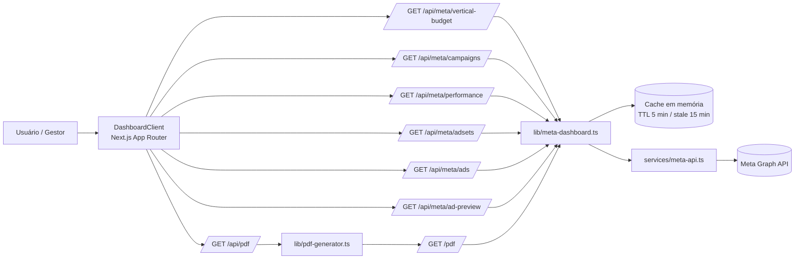

# Documentação Completa da Aplicação

Atualizado em: 2026-03-06

## 1. Visão geral

O projeto `Meta Ads Intelligence | VIASOFT` é um dashboard executivo para leitura de performance de campanhas Meta Ads, com:

- filtro por vertical;
- lista fixa de verticais suportadas (`VIASOFT`, `Agrotitan`, `Construshow`, `Filt`, `Petroshow`, `Voors`);
- filtro por campanha ativa;
- filtro de período (7, 14, 28, 30 dias);
- comparativo automático contra período anterior equivalente;
- estrutura da campanha (ad sets e ads);
- insights e recomendações por objetivo;
- exportação de PDF em backend via Puppeteer.
- monitoramento de investimento mensal da vertical mesmo sem campanhas ativas no momento.

Problema que o projeto resolve:

- o Gerenciador de Anúncios da Meta é completo, mas denso para leituras executivas rápidas;
- gestores e liderança normalmente precisam de leitura resumida, comparativa e padronizada;
- a aplicação reduz ruído operacional, organiza métricas-chave e gera PDF pronto para rituais de decisão.

Arquitetura atual:

- Frontend e API no mesmo app Next.js (App Router).
- Banco de dados persistido via Supabase.
- Sem autenticação (MVP local).
- Cache em memória de processo assistido por store do Supabase.

## 2. Objetivo funcional

A aplicação entrega leitura executiva para público não técnico, mantendo rastreabilidade com dados reais da Meta API e evitando métricas artificiais.

Princípios implementados no código:

- O banco Supabase atua como fonte de verdade consolidada para as métricas.
- Períodos de performance não incluem o dia atual.
- Orçamento mensal da vertical inclui o dia atual (parcial no momento da consulta).
- Comparativo sempre usa janela anterior equivalente.
- Apenas campanhas com veiculação ativa entram na seleção principal.

## 3. Stack e versões

Fonte: `package.json`.

- Next.js `16.1.6` (App Router)
- React `19.0.0`
- TypeScript `5.8.2`
- TailwindCSS `3.4.17`
- Recharts `2.15.1`
- Puppeteer Core `24.31.0`
- Chromium serverless `@sparticuz/chromium 133.0.0`
- Vercel Analytics e Speed Insights
- ESLint + Next config
- CSpell (pt-BR + dicionário de projeto)

### 3.1 Setup local (Getting Started)

```bash
npm install
npm run dev
```

Aplicação local:

- `http://localhost:3000`

## 4. Arquitetura de alto nível

### 4.1 Camadas

- UI client: `components/*`, `app/page.tsx`
- API interna (BFF): `app/api/*`
- Orquestração + cache: `lib/meta-dashboard.ts`
- Integração externa (Meta Graph API): `services/meta-api.ts`
- Regras e cálculos: `utils/*`
- Renderização para impressão: `app/pdf/page.tsx`, `lib/pdf-generator.ts`, `pdf/*`

### 4.2 Runtime

- Todas as rotas de API críticas usam `runtime = "nodejs"` e `dynamic = "force-dynamic"`.
- Home e PDF page também são `force-dynamic`.
- PDF é gerado via navegação server-side para rota interna `/pdf`.

### 4.3 Diagrama de arquitetura (Mermaid)



## 5. Fluxos principais

## 5.1 Carregamento inicial do dashboard

1. `app/page.tsx` renderiza `DashboardClient`.
2. `DashboardClient` chama `GET /api/meta/campaigns`.
3. `DashboardClient` chama `GET /api/meta/vertical-budget` para a vertical selecionada.
4. Usuário seleciona campanha/período.
5. Front chama `GET /api/meta/performance`.
6. Front chama estrutura:
- `GET /api/meta/adsets`
- `GET /api/meta/ads`
7. Se não houver campanhas ativas na vertical, UI mantém card de orçamento e exibe aviso.
8. UI monta cards, tendência, gráfico, insights, recomendações e card de orçamento vertical.

## 5.2 Atualização manual

Botão `Atualizar Dados` executa refresh forçado:

- campanhas (`refresh=1`)
- orçamento da vertical (`refresh=1`)
- performance (`refresh=1`)
- adsets (`refresh=1`)
- ads (`refresh=1`)

Se a Meta API falhar, o backend pode retornar snapshot stale dentro de janela de contingência.

## 5.3 Preview avançado de anúncio

1. Clique no thumbnail no painel de estrutura.
2. Front chama `GET /api/meta/ad-preview?adId=...`.
3. Backend tenta formatos de preview em ordem:
- `DESKTOP_FEED_STANDARD`
- `MOBILE_FEED_STANDARD`
- `INSTAGRAM_STANDARD`
4. Se achar iframe URL válida, exibe modal com iframe.
5. Se não, cai para imagem do criativo quando disponível.

## 5.4 Geração de PDF

1. Front abre `/api/pdf?campaignId=...&rangeDays=...`.
2. API valida parâmetros.
3. `lib/pdf-generator.ts` abre browser headless.
4. Browser visita `/pdf?campaignId=...&rangeDays=...`.
5. Aguarda `data-pdf-ready=true` (com timeout de segurança).
6. Exporta A4 paisagem com `printBackground`.
7. Download retorna com nome dinâmico baseado em campanha + data.

## 5.5 Casos de uso principais

1. Gestor semanal:
- acessa o dashboard na segunda-feira;
- filtra pela vertical e campanha;
- valida semáforo executivo e tendência;
- exporta PDF para reunião de diretoria.

2. Analista de performance:
- faz refresh dos dados;
- compara período atual vs período anterior;
- inspeciona estrutura de ad sets/ads e destino;
- usa insights/recomendações para priorizar otimizações.

3. Liderança executiva:
- consome apenas os blocos de alto nível;
- acompanha orçamento da vertical com imposto;
- usa PDF como evidência padronizada para tomada de decisão.

## 6. Contrato da API interna

Base: `app/api/*`.

## 6.1 Validação de ambiente (rotas meta)

Rotas `app/api/meta/*` validam:

- `META_ACCESS_TOKEN` obrigatório
- `META_AD_ACCOUNT_ID` obrigatório

Erro padrão: status `400` com `{ "error": "..." }`.

## 6.2 `GET /api/meta/campaigns`

Query:

- `refresh=1` (opcional)

Sucesso:

```json
{
  "data": [
    {
      "id": "120219312345670001",
      "name": "[VIASOFT] [Vertical A] [TRAFFIC] Campanha Safra",
      "objective": "OUTCOME_TRAFFIC",
      "objectiveCategory": "TRAFFIC",
      "effectiveStatus": "ACTIVE",
      "verticalTag": "Vertical A",
      "deliveryStatus": "ACTIVE"
    }
  ],
  "meta": {
    "count": 1,
    "refreshed": false
  }
}
```

Erros:

- `400`: env ausente
- `502`: erro de integração ou regra de domínio

## 6.3 `GET /api/meta/performance`

Query:

- `campaignId` (obrigatório)
- `rangeDays` (7|14|28|30, default 7)
- `refresh=1` (opcional)

Sucesso:

```json
{
  "data": {
    "campaign": {
      "id": "120219312345670001",
      "name": "[VIASOFT] [Vertical A] [TRAFFIC] Campanha Safra",
      "objective": "OUTCOME_TRAFFIC",
      "objectiveCategory": "TRAFFIC",
      "effectiveStatus": "ACTIVE",
      "verticalTag": "Vertical A",
      "deliveryStatus": "ACTIVE"
    },
    "range": {
      "days": 7,
      "since": "2026-02-27",
      "until": "2026-03-05",
      "previousSince": "2026-02-20",
      "previousUntil": "2026-02-26"
    },
    "comparison": {
      "current": {
        "spend": 1240.55,
        "impressions": 56210,
        "clicks": 1840,
        "ctr": 3.27,
        "cpc": 0.67,
        "results": 1715,
        "costPerResult": 0.72,
        "primaryMetricKey": "link_clicks",
        "primaryMetricLabel": "Cliques no link"
      },
      "previous": {
        "spend": 1098.23,
        "impressions": 48790,
        "clicks": 1492,
        "ctr": 3.05,
        "cpc": 0.74,
        "results": 1410,
        "costPerResult": 0.78,
        "primaryMetricKey": "link_clicks",
        "primaryMetricLabel": "Cliques no link"
      },
      "deltas": {
        "spend": { "absolute": 142.32, "percent": 12.96 },
        "impressions": { "absolute": 7420, "percent": 15.21 },
        "clicks": { "absolute": 348, "percent": 23.32 },
        "ctr": { "absolute": 0.22, "percent": 7.21 },
        "cpc": { "absolute": -0.07, "percent": -9.46 },
        "results": { "absolute": 305, "percent": 21.63 },
        "costPerResult": { "absolute": -0.06, "percent": -7.69 }
      },
      "trend": {
        "direction": "positive",
        "score": 4,
        "message": "Crescimento consistente no período comparativo, com eficiência operacional preservada."
      }
    },
    "verticalBudget": {
      "verticalTag": "Vertical A",
      "monthlyCap": 535,
      "monthSince": "2026-02-24",
      "monthUntil": "2026-03-23",
      "dataUntil": "2026-03-06",
      "includesCurrentDay": true,
      "spentInMonth": 389.45,
      "remainingInMonth": 145.55,
      "overBudgetAmount": 0,
      "utilizationPercent": 72.79,
      "hasElapsedDays": true,
      "timezone": "America/Sao_Paulo"
    },
    "chart": [
      {
        "date": "2026-02-27",
        "spend": 173.32,
        "impressions": 8031,
        "clicks": 260,
        "ctr": 3.24,
        "cpc": 0.67,
        "results": 248,
        "costPerResult": 0.7
      }
    ],
    "insights": [
      {
        "type": "opportunity",
        "title": "Ambiente favorável para ampliação gradual de investimento",
        "message": "A performance atual permite expansão progressiva de verba com manutenção da eficiência unitária."
      }
    ],
    "recommendations": [
      {
        "title": "Estratégia criativa para cliques",
        "message": "Priorize três variações criativas com CTA explícito no início da peça para ampliar link_clicks."
      }
    ],
    "generatedAt": "2026-03-06T20:18:42.000Z"
  }
}
```

Erros:

- `400`: campanha ausente, período inválido, env ausente
- `502`: erro de negócio/integração

## 6.4 `GET /api/meta/adsets`

Query:

- `campaignId` (obrigatório)
- `refresh=1` (opcional)

Sucesso:

```json
{
  "data": [
    {
      "id": "120219312345670991",
      "name": "AS - Públicos Quentes",
      "campaignId": "120219312345670001",
      "effectiveStatus": "ACTIVE",
      "configuredStatus": "ACTIVE"
    }
  ],
  "meta": {
    "campaignId": "123",
    "count": 1,
    "refreshed": false
  }
}
```

Erros:

- `400`: parâmetros/env
- `502`: integração

## 6.5 `GET /api/meta/ads`

Query:

- `adSetId` (obrigatório)
- `refresh=1` (opcional)

Sucesso:

```json
{
  "data": [
    {
      "id": "120219312345670888",
      "name": "AD - Vídeo 15s CTA WhatsApp",
      "campaignId": "120219312345670001",
      "adSetId": "120219312345670991",
      "effectiveStatus": "ACTIVE",
      "configuredStatus": "ACTIVE",
      "creativeId": "120219312345670777",
      "creativeName": "Criativo Safra 15s",
      "creativePreviewUrl": "https://example-cdn/meta/creative-120219312345670777.jpg",
      "destinationUrl": "https://wa.me/5511999999999"
    }
  ],
  "meta": {
    "adSetId": "123",
    "count": 1,
    "refreshed": false
  }
}
```

Erros:

- `400`: parâmetros/env
- `502`: integração

## 6.6 `GET /api/meta/ad-preview`

Query:

- `adId` (obrigatório)
- `refresh=1` (opcional)

Sucesso:

```json
{
  "data": {
    "adId": "120219312345670888",
    "adFormat": "DESKTOP_FEED_STANDARD",
    "iframeUrl": "https://business.facebook.com/ads/api/preview_iframe.php?d=..."
  },
  "meta": {
    "adId": "123",
    "refreshed": false
  }
}
```

Erros:

- `400`: parâmetros/env
- `502`: integração

## 6.7 `POST /api/meta/cache/invalidate`

Body:

- `{ "scope": "all" }`
- `{ "scope": "campaigns" }`
- `{ "scope": "performance", "campaignId": "...", "rangeDays": 7 }`

Sucesso:

- `ok: true` + metadados de invalidação.

Exemplo de resposta (`scope = performance`):

```json
{
  "ok": true,
  "scope": "performance",
  "removedKeys": 1,
  "message": "Cache da campanha/período invalidado"
}
```

Erros:

- `400`: payload inválido/env ausente.

## 6.8 `GET /api/pdf`

Query:

- `campaignId` (opcional)
- `verticalTag` (opcional, obrigatório quando `campaignId` não for enviado)
- `rangeDays` (7|14|28|30)

Sucesso:

- `200` com `Content-Type: application/pdf`
- `Content-Disposition: attachment; filename="..."`

Erros:

- `400`: parâmetros inválidos
- `500`: falha de geração de PDF

Exemplo de erro:

```json
{
  "error": "Período inválido. Use 7, 14, 28 ou 30"
}
```

## 6.9 `GET /api/meta/vertical-budget`

Query:

- `verticalTag` (obrigatório)
- `refresh=1` (opcional)

Sucesso:

```json
{
  "data": {
    "verticalTag": "VIASOFT",
    "monthlyCap": 535,
    "monthSince": "2026-02-24",
    "monthUntil": "2026-03-23",
    "dataUntil": "2026-03-06",
    "includesCurrentDay": true,
    "spentInMonth": 389.45,
    "remainingInMonth": 145.55,
    "overBudgetAmount": 0,
    "utilizationPercent": 72.79,
    "hasElapsedDays": true,
    "timezone": "America/Sao_Paulo"
  },
  "meta": {
    "verticalTag": "VIASOFT",
    "refreshed": false
  }
}
```

Erros:

- `400`: `verticalTag` ausente ou fora da lista suportada
- `502`: erro de integração com Meta API

## 7. Variáveis de ambiente

Referência: `.env.example` + uso no código.

Obrigatórias:

- `META_ACCESS_TOKEN`
- `META_AD_ACCOUNT_ID`

Altamente recomendadas:

- `META_API_VERSION` (default `v21.0`)
- `APP_BASE_URL` (PDF em ambiente com host diferente)
- `APP_TIMEZONE` (default `America/Sao_Paulo`)

Opcionais:

- `VERTICAL_MONTHLY_CAP_BRL` (default `535`)
- `META_WHATSAPP_NUMBER_BY_PAGE_ID_JSON`
- `INSIGHTS_MIN_IMPRESSIONS` (default `1000`)
- `INSIGHTS_MIN_CLICKS` (default `30`)
- `INSIGHTS_MIN_RESULTS` (default `5`)
- `INSIGHTS_BASELINE_ACCOUNT_JSON`
- `INSIGHTS_BASELINE_BY_VERTICAL_JSON`
- `META_DESTINATION_DIAGNOSTIC_LOG` (`1` habilita logs estruturados)
- `CHROME_EXECUTABLE_PATH` / `PUPPETEER_EXECUTABLE_PATH` (PDF local)
- Variáveis de runtime serverless (`VERCEL`, `AWS_*`) afetam escolha de browser

## 8. Modelo de dados principal

Fonte: `lib/types.ts`.

Entidades:

- `MetaCampaign`
- `MetaAdSet`
- `MetaAd`
- `MetaAdPreview`

Estruturas analíticas:

- `DateRangeSelection`
- `NormalizedInsightRow`
- `MetricSnapshot`
- `MetricDelta`
- `MetricComparison`
- `DailyMetricPoint`
- `TrendSummary`
- `InsightMessage`
- `Recommendation`
- `VerticalBudgetSummary`
- `DashboardPayload`

Enums/tipos chave:

- `RangeDays = 7 | 14 | 28 | 30`
- `ObjectiveCategory = TRAFFIC | ENGAGEMENT | RECOGNITION | CONVERSIONS`
- `DeliveryStatus = ACTIVE | COMPLETED | ADSET_DISABLED | WITHOUT_DELIVERY`

## 9. Regras de negócio implementadas

## 9.1 Campanhas elegíveis no seletor

Uma campanha só entra no seletor quando:

- `effective_status` da campanha é `ACTIVE`;
- e o status de entrega calculado por ad sets também é `ACTIVE`.

Campanhas com ad sets pausados/encerrados ficam fora da lista principal.

## 9.2 Período de análise

`utils/date-range.ts`:

- Dia atual nunca entra na janela de performance.
- `until = ontem` no fuso configurado.
- `since = until - (days - 1)`.
- Período anterior é a janela imediatamente anterior com mesmo tamanho.

## 9.3 Ciclo de orçamento por vertical

`utils/month-range.ts`:

- Ciclo fixo Meta: dia 24 até dia 23.
- Se o dia atual for antes do dia 24, considera ciclo iniciado no mês anterior.
- Coleta para card de orçamento vai até a data atual no fuso configurado, sem extrapolar fim do ciclo.
- Campo `dataUntil` informa até qual data os dados foram acumulados no card.
- Campo `includesCurrentDay` sinaliza se o dia atual entrou no acumulado.

`services/meta-api.ts` (cálculo de gasto por vertical):

- Somatório considera somente linhas com veiculação no período (`impressions > 0`) e gasto positivo (`spend > 0`).
- A regra aproxima o comportamento do filtro "Tiveram veiculação" do Ads Manager.
- Campanhas pausadas/concluídas ainda contam, desde que tenham entregue no período consultado.

## 9.4 Regra de teto + imposto no card

`components/dashboard-report.tsx`:

- imposto fixo: `12.15%` sobre `spentInMonth`;
- total operacional = investimento + imposto;
- destaque principal de investimento exibe o total operacional (com imposto);
- progresso da barra usa teto total (cap + imposto);
- exibe saldo disponível ou excedente.

## 9.5 Métrica principal por objetivo

`utils/objective.ts` + `utils/metrics.ts`:

- TRAFFIC: `link_click`
- ENGAGEMENT: `post_engagement`
- RECOGNITION: `impressions`
- CONVERSIONS: `conversions` (fallback por hints de `actions`)

## 9.6 Classificação de tendência

`utils/metrics.ts`:

Score considera principalmente:

- delta de resultados
- delta de CTR
- delta de CPC (inverso)
- delta de custo por resultado (quando disponível)

Saídas:

- `positive`
- `neutral`
- `negative`

## 9.7 Semáforo executivo

`utils/executive-signal.ts`:

- Ações: `MANTER`, `REVISAR`, `INTERVIR`.
- Antes de decidir, valida amostra mínima:
- `impressions >= 1000`
- `clicks >= 30`
- `max(currentResults, previousResults) >= 5`
- Se não atingir amostra, retorna `REVISAR` por baixa confiança.

## 9.8 Insights e recomendações

`utils/insights-engine.ts`:

- Baselines default de CTR e limite de CPC por objetivo.
- Baselines podem ser sobrescritos por:
- conta (`INSIGHTS_BASELINE_ACCOUNT_JSON`)
- vertical (`INSIGHTS_BASELINE_BY_VERTICAL_JSON`)
- Alertas incluem:
- CTR abaixo da referência
- CPC acima da referência
- queda relevante de resultados
- alta de custo por resultado
- Retorna até 4 insights (inclui leitura de tendência) e até 3 recomendações.

## 9.9 Verticais suportadas e comportamento sem campanhas ativas

- Lista fixa de verticais no seletor:
- `VIASOFT`
- `Agrotitan`
- `Construshow`
- `Filt`
- `Petroshow`
- `Voors`
- Mesmo sem campanhas ativas na vertical selecionada:
- o card de investimento mensal continua visível;
- o sistema exibe aviso de ausência de campanhas ativas;
- a estrutura e os cards de performance permanecem sem dados até haver campanha ativa.

## 10. Cache e resiliência

## 10.1 Infra de cache

`lib/cache.ts`:

- cache em memória (`Map`) com TTL por entrada;
- suporte a leitura stale (`getStale`) por idade máxima;
- escopo global em `globalThis` para reaproveitar em hot reload dev.

## 10.2 Chaves de cache

`lib/cache-keys.ts`:

- campanhas: `campaigns:active`
- ad sets: `structure:adsets:{campaignId}`
- ads: `structure:ads:v2:{adSetId}`
- ad preview: `structure:ad-preview:v1:{adId}`
- performance: `performance:{campaignId}:{rangeDays}:{rangeUntil}`
- orçamento vertical: `budget:vertical:{vertical}:{monthUntil}`

## 10.3 Política

`lib/meta-dashboard.ts`:

- TTL principal: 5 min
- Janela stale: 15 min
- Leitura padrão: cache fresco
- Falha de API: pode retornar stale se disponível
- Sem stale: erro é propagado para API/UI

## 10.4 Invalidação

Disponível por endpoint:

- limpar tudo
- limpar campanhas
- limpar performance por campanha + período

## 11. Integração com Meta API (detalhes)

Fonte: `services/meta-api.ts`.

## 11.1 Configuração básica

- Base URL: `https://graph.facebook.com/{version}`
- Token enviado como query `access_token`.
- `META_AD_ACCOUNT_ID` aceita com ou sem prefixo `act_`.

## 11.2 Paginação e proteção

- `fetchMetaList` segue `paging.next`.
- Limite de segurança: máx. 60 páginas.

## 11.3 Tratamento de rate limit

- Quando Meta retorna `code 17`, inicia cooldown de 60s.
- Durante cooldown, novas chamadas falham rápido com mensagem de espera.

## 11.4 Filtro de entrega real

- A entrega da campanha é inferida por ad sets ativos com status efetivo/configurado e janela de tempo.
- Razões sem entrega classificadas como:
- `COMPLETED`
- `ADSET_DISABLED`
- `WITHOUT_DELIVERY`

## 11.5 Resolução de destino de anúncio

Pipeline robusto para achar `destinationUrl`:

- CTA links do creative
- story spec (link_data/video/photo/template)
- asset feed links
- object/link url do creative
- contexto de ad set (`destination_type`, `promoted_object`, objetivo)
- descompactação de redirects `l.facebook.com` / `l.instagram.com`
- heurísticas para WhatsApp, Messenger, Instagram Direct e tráfego web

Fallbacks importantes:

- `Site configurado na Meta Ads (URL não exposta pela API)`
- `WhatsApp` (sem número quando a API não expõe telefone)
- `Messenger (destino não identificado)`

Para conjuntos de WhatsApp, ads sem destino útil podem receber fallback para `wa.me/{número}` quando possível.

## 11.6 Diagnóstico opcional

Se `META_DESTINATION_DIAGNOSTIC_LOG=1`, logs estruturados são emitidos com:

- motivo da falha de destino;
- sinais de campanha/ad set/creative;
- presença de campos no payload;
- sem exposição de token.

## 12. Frontend: comportamento por componente

## 12.1 Shell e página

- `app/layout.tsx`: metadata, fontes, Analytics/SpeedInsights.
- `app/page.tsx`: injeta `DashboardClient`.
- `app/globals.css`: tokens visuais, classes utilitárias, regras print/PDF.

## 12.2 Cliente principal

- `components/dashboard-client.tsx`:
- controla estado global de seleção e loading;
- mantém lista fixa de verticais suportadas;
- carrega orçamento mensal por vertical via endpoint dedicado;
- executa chamadas API;
- renderiza erros e contingência de snapshot stale;
- aciona geração PDF e refresh manual.

## 12.3 Blocos de relatório

- `components/dashboard-report.tsx`:
- card de cabeçalho de campanha;
- card de orçamento vertical;
- cards métricos;
- tendência;
- gráfico;
- insights/recomendações.

- `components/metric-card.tsx`:
- status de saúde por métrica (`healthy/warning/critical/na`).

- `components/trend-card.tsx`:
- semáforo executivo + drivers principais.

- `components/performance-chart.tsx`:
- gráfico combinado (results + spend), tooltip detalhado e layout responsivo.

- `components/insights-panel.tsx`:
- render de insights e recomendações em tom visual por severidade.

## 12.4 Estrutura de campanha

- `components/campaign-structure-panel.tsx`:
- listas de ad sets e ads;
- preview em modal;
- links de destino com formatação amigável.

## 12.5 Selects customizados

- `components/vertical-selector.tsx`
- `components/campaign-selector.tsx`
- `components/period-selector.tsx`

Todos com:

- teclado (setas, enter, escape, home/end);
- foco controlado;
- fechamento por clique externo.

## 12.6 Branding e PDF readiness

- `components/brand-mark.tsx`: aplica logos por CSS mask.
- `components/pdf-ready-flag.tsx`: sinaliza quando página está pronta para captura.

## 13. PDF: layout e padrões

## 13.1 Config

- `pdf/layout-preset.ts`:
- `PDF_LAYOUT_VERSION = v1`
- `PDF_TOTAL_PAGES = 5`
- viewport `1754x1240`

- `pdf/print-config.ts`:
- constantes auxiliares de página.

## 13.2 Conteúdo por página

`app/pdf/page.tsx`:

1. Capa + seletores + orçamento vertical
2. Informações da campanha + estrutura da campanha (ad sets e ads)
3. Cards métricos
4. Tendência + gráfico diário
5. Insights + recomendações

## 13.3 Robustez de geração

- Espera seletor de pronto para evitar PDF incompleto.
- Remove artefatos de dev overlay do Next.
- Emula media print antes de exportar.
- Nome do arquivo é gerado com slug limpo e data BR.

## 14. Estilo, UX e responsividade

Base:

- Tailwind + tokens em `globals.css`.
- Paleta centrada em `viasoft` + tons de status.
- Animações leves (`enter-fade`, `hover-lift`) desligadas no print.

Responsividade:

- layout principal mobile-first;
- gráfico ajusta ticks e dimensões por largura;
- overlays de preview com scroll controlado;
- classes de print evitam quebra de bloco relevante.

## 15. Observabilidade e erros

- APIs retornam erro textual claro por endpoint.
- UI prefixa erro com contexto (`Campaigns:`, `Performance:`, `Estrutura:`).
- Snapshot stale gera alerta visual de contingência.
- Logs diagnósticos opcionais para destino de anúncio.

### 15.1 Erros comuns (troubleshooting rápido)

1. `META_ACCESS_TOKEN não configurado` / `META_AD_ACCOUNT_ID não configurado`
- causa provável: `.env.local` ausente ou sem variáveis obrigatórias;
- ação rápida: preencher env e reiniciar `npm run dev`.

2. Sem campanhas no seletor
- causa provável: ausência de campanhas com status ativo e entrega ativa;
- ação rápida: validar status na conta Meta e permissões do token.

3. Aviso de contingência no dashboard
- causa provável: falha da Meta API no último refresh;
- ação rápida: repetir refresh, validar conectividade e permissões; o sistema usa snapshot stale temporário.

4. Falha de PDF em ambiente local
- causa provável: Chrome local não encontrado;
- ação rápida: definir `CHROME_EXECUTABLE_PATH` no `.env.local`.

5. Erro de imagem em base64 (integrações/sessões de suporte)
- sintoma: payload de imagem não processa ou chega truncado;
- causa provável: string base64 incompleta, truncamento de envio ou histórico da sessão corrompido;
- ação rápida: reenviar a imagem completa em uma única mensagem e, se necessário, limpar o histórico/contexto da sessão antes de tentar novamente.

## 16. Build, qualidade e operação

Scripts (`package.json`):

- `npm run dev`
- `npm run build`
- `npm run start`
- `npm run lint`
- `npm run typecheck`
- `npm run spellcheck`

Configs:

- `tsconfig.json`: strict true, paths `@/*`.
- `next.config.mjs`: strict mode + serverExternalPackages para PDF libs.
- `eslint.config.mjs`: Next core-web-vitals + typescript.
- `postcss.config.js`: tailwind + autoprefixer.
- `cspell.json`: pt-BR + dicionário local.

## 17. Segurança e limitações

Implementado:

- token fica apenas no backend (`process.env`).
- `.env.local` ignorado no git.
- sem persistência de dados sensíveis.

Limitações atuais:

- sem auth/autorização (MVP).
- cache apenas em memória do processo (não distribuído).
- algumas campanhas podem não expor URL final de destino pela API Meta.

## 18. Inventário de arquivos (código e suporte)

## 18.1 Raiz

- `README.md`: guia rápido de setup e uso.
- `.env.example`: template de ambiente.
- `package.json`: scripts e dependências.
- `package-lock.json`: lock de dependências.
- `next.config.mjs`: config Next.
- `tsconfig.json`: config TypeScript.
- `tailwind.config.ts`: tokens e content paths.
- `postcss.config.js`: pipeline CSS.
- `eslint.config.mjs`: lint setup.
- `next-env.d.ts`: referências de tipos Next.
- `cspell.json`: spellcheck.
- `.gitignore`: ignores de repo.
- `.gitattributes`: normalização de EOL.
- `tmp_preview.json`: amostra de payload de preview Meta.
- `tmp_preview_iframe.html`: dump técnico de iframe preview (debug).
- `tmp_shareable_preview.html`: dump técnico de preview compartilhável (debug).

## 18.2 `app/`

- `app/layout.tsx`: layout raiz + metadata + analytics.
- `app/page.tsx`: entrypoint da home.
- `app/globals.css`: estilos globais e print.
- `app/pdf/page.tsx`: página de render para PDF.
- `app/api/pdf/route.ts`: endpoint de exportação PDF.
- `app/api/meta/campaigns/route.ts`: endpoint campanhas.
- `app/api/meta/vertical-budget/route.ts`: endpoint de orçamento mensal por vertical.
- `app/api/meta/performance/route.ts`: endpoint performance.
- `app/api/meta/adsets/route.ts`: endpoint ad sets.
- `app/api/meta/ads/route.ts`: endpoint ads.
- `app/api/meta/ad-preview/route.ts`: endpoint preview de ad.
- `app/api/meta/cache/invalidate/route.ts`: endpoint de invalidação de cache.

## 18.3 `components/`

- `components/dashboard-client.tsx`: estado principal e orquestração client-side.
- `components/dashboard-report.tsx`: bloco de relatório executivo.
- `components/campaign-structure-panel.tsx`: estrutura da campanha + modal preview.
- `components/metric-card.tsx`: card de métrica com saúde.
- `components/trend-card.tsx`: tendência e semáforo executivo.
- `components/performance-chart.tsx`: gráfico diário.
- `components/insights-panel.tsx`: insights e recomendações.
- `components/campaign-selector.tsx`: select custom de campanha.
- `components/vertical-selector.tsx`: select custom de vertical.
- `components/period-selector.tsx`: select custom de período.
- `components/brand-mark.tsx`: render de logo/icon institucional.
- `components/pdf-ready-flag.tsx`: marcador de pronto para captura.

## 18.4 `lib/`

- `lib/types.ts`: contratos de tipos centrais.
- `lib/cache.ts`: cache em memória.
- `lib/cache-keys.ts`: convenções de chave.
- `lib/meta-dashboard.ts`: orquestração de domínio e cache.
- `lib/pdf-generator.ts`: engine de geração PDF com Puppeteer.
- `lib/branding.ts`: constantes institucionais.
- `lib/verticals.ts`: lista canônica de verticais suportadas.

## 18.5 `services/`

- `services/meta-api.ts`: camada de integração com Meta Graph API.

## 18.6 `utils/`

- `utils/date-range.ts`: janela atual e comparativa (sem dia atual).
- `utils/month-range.ts`: ciclo 24->23 para orçamento vertical.
- `utils/metrics.ts`: snapshots, deltas, tendência e série diária.
- `utils/metric-health.ts`: classificação de saúde por métrica.
- `utils/executive-signal.ts`: semáforo executivo.
- `utils/insights-engine.ts`: insights e recomendações por objetivo.
- `utils/objective.ts`: mapeamento de objetivo e métrica principal.
- `utils/campaign-tags.ts`: extração de vertical do nome da campanha.
- `utils/vertical-ui.ts`: mapeamento visual de verticais.
- `utils/formatters.ts`: formatação BRL/percent/date.
- `utils/numbers.ts`: utilitários numéricos.

## 18.7 `pdf/`

- `pdf/layout-preset.ts`: constantes de layout PDF.
- `pdf/print-config.ts`: constantes auxiliares de impressão.

## 18.8 `docs/`

- `docs/RUNBOOK.md`: operação e troubleshooting.
- `docs/BUSINESS_RULES.md`: regras de negócio oficiais.
- `docs/HANDOFF.md`: estado técnico para continuidade.
- `docs/SESSION_MEMORY.md`: timeline de decisões/mudanças.
- `docs/RESUME_PROMPT.md`: prompt padrão de retomada.
- `docs/DOCUMENTACAO_COMPLETA.md`: este documento.

## 18.9 `public/`

- `public/logos/viasoft-logo.svg`: logo institucional.
- `public/logos/viasoft-icon.svg`: ícone institucional.
- `public/icons/verticais/*.svg`: ícones por vertical para UI.

## 18.10 `api/`

- `api/README.md`: nota de organização (rotas reais em `app/api/*`).

## 18.11 `.cspell/`

- `.cspell/project-words.txt`: termos permitidos no spellcheck.

## 19. Como manter esta documentação atualizada

Quando houver alteração de regra/fluxo:

1. Atualizar `docs/DOCUMENTACAO_COMPLETA.md`.
2. Atualizar `docs/BUSINESS_RULES.md` se for regra funcional.
3. Atualizar `docs/HANDOFF.md` e `docs/SESSION_MEMORY.md` para continuidade.
4. Validar com `npm run typecheck` e fluxo manual principal (campanhas, performance, estrutura, PDF).


## 20. Atualização recente (2026-03-07)

### 20.1 PDF sem campanha ativa

- A exportação de PDF foi estendida para cenários sem campanha ativa na vertical selecionada.
- Agora o endpoint aceita dois modos:
- `GET /api/pdf?campaignId=...&rangeDays=...` (relatório completo de campanha)
- `GET /api/pdf?verticalTag=...&rangeDays=...` (resumo de investimento da vertical)
- No modo por `verticalTag`, o PDF renderiza a capa executiva com seletores e card de orçamento mensal da vertical, incluindo aviso de ausência de campanhas ativas.

### 20.2 Ajuste no botão de exportação

- O botão `Gerar PDF` deixou de depender exclusivamente de campanha selecionada.
- Quando não há campanha ativa na vertical, ele exporta o PDF de orçamento da vertical normalmente.
